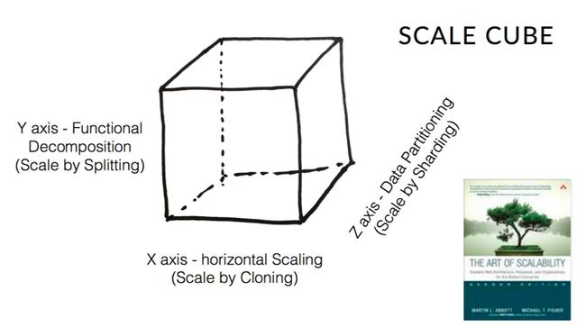

# Notes

## AKF 立方体模型

```md
从三个纬度讲述功能拆分、水平扩展、数据分区所产生的复杂度，
如果只有一个系统，单台部署，单点存储，那么它就应该只是一个点，
因为随着量级的增大，系统在每个纬度不断延长，逐渐成为一个庞大的立方体。
```
* 拆分
```md
按照AKF模型，拆分可以分为系统拆分、功能拆分和读写拆分。
```
```md
如一个单体系统中
按照用户的交互场景看，门户首页可以拆分为前台系统，
类目、商品、搜索等功能可以拆分到商品中心，订单、结算、发票等功能则可以拆分到交易中心，这就是简单的系统拆分和功能拆分。
而有些功能较为特殊，如商详页，在读取时需要聚合读取，所以又可以进行读写拆分。
```
