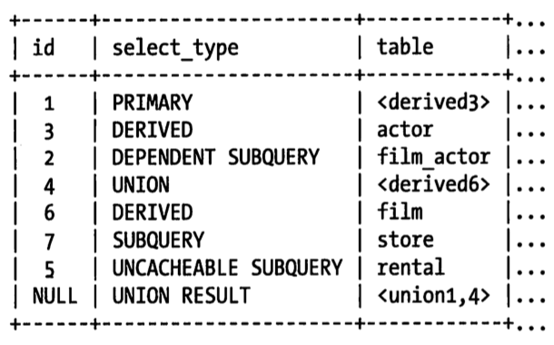

# EXPLAIN
```md
EXPLAIN 将帮助你了解 MySQL 优化器是如何工作的。
这个功能具有局限性，并不总能说出真相，但它的输出是可以获取的最好信息。
```
## Invoking EXPLAIN
```md
如果查询在FROM子句中包括子查询，EXPLAIN时，MySQL实际会执行该子查询，
将其结果存放在一个临时表中，然后完成外层查询的优化。
这意味着包含开销较大的子查询或使用临时表算法的视图，实际上会给服务器带来大量工作。
```
* EXPLAIN 的一些限制
```md
* 不是显示 触发器、存储过程和 UDF 对查询的影响
* 不支持存储过程
* 不显示查询执行中的特定优化
* 不显示关于查询的执行计划的所有信息
* 不区分具有相同名字的事务。
  如内存排序和临时文件都使用“filesort”，并且对于磁盘上和内存中的临时表都显示“Using temporary”
* 可能会误导。
```
## 重写非 SELECT 查询
```md
MySQL 5.6 开始运行 解释 非SELECT 查询，之前的版本可以通过重写 转换成“等价的SELECT”查询。
```

## EXPLAIN 输出中的列
* id
```md
如果只有唯一的SELECT，会输出一条记录，编号为1。

对于复杂 SELECT 查询，分为三类：
简单子查询
派生表（FROM 子句中的子查询）
UNION 查询

内层的SELECT一般会顺序编号，对应于其在原始语句中的位置。
```
* select_type
```md
输出对于行式简单还是复杂SELECT。

* SIMPLE
* PRIMARY
  复杂查询的外层标记
* SUBQUERY
  包含在SELECT 列表中的子查询中的SELECT（即不在FROM子句中）
* DERIVED [adj. 导出的；衍生的，派生的]
  表示包含在FROM子句中的 SELECT。
  MySQL会递归执行并将结果放到一个临时表中，内部称其“派生表”，
  因为该临时表是从子查询中派生出来的。
* UNION
  在UNION中的第二个和随后的SELECT被标记为 UNION。
  如果UNION 被FROM 子句中的子查询包含，那么第一个 SELECT 会被标记为 DERIVED。
* UNION RESULT
  用来从UNION 的匿名临时表检索结果的SELECT 标记为 UNION RESULT。
* DEPENDENT
* UNCACHEABLE
  SUBQUERY 和 UNION 可以被标记为 DEPENDENT 和 UNCACHEABLE，
  DEPENDENT 意味着 SELECT 依赖于外层查询发现的数据。
  UNCACHEABLE 意味着 SELECT 中的某些特性阻止结果被缓存在一个Item_cache中。 
```
* table
```md
输出正在访问哪个表。

当 FROM 中有子句时，table 列式<derivedN>的形式，其中N是子查询的id。
当 UNION 时，UNION RESULT 的table列包含一个参与 UNION 的id列表。
```
```sql
EXPLAIN
SELECT actor_id,
   (SELECT 1 FROM sakila.film_actor WHERE film_actor.actor_id =
      der_1.actor_id LIMIT 1)
FROM (
   SELECT actor_id
   FROM sakila.actor LIMIT 5
) AS der_1
UNION ALL
SELECT film_id,
   (SELECT @var1 FROM sakila.rental LIMIT 1)
FROM (
   SELECT film_id,
      (SELECT 1 FROM sakila.store LIMIT 1)
   FROM sakila.film LIMIT 5
) AS der_2;
```


* type
```md
输出 访问类型，即如果查找表中的行。
以下是最重要的访问方式，依次从最差到最优

* ALL
全表扫描，例外：查询使用了LIMIT，或Extra列显式“Using distinct/not exists”
* index
跟全表扫描一样，只是扫描表时按照索引次序进行而不是行。
主要优点是避免了排序，缺点是要承担按照索引次序读取整个表的开销。
通常意味着若若是按 随机次序访问行，开销会非常大。

如果Extra中显示“Using index”，说明使用覆盖索引，此时只扫描索引的数据，开销要少很多。
* range
范围扫描就是一个有限制的索引扫描，开始于索引里的某一点，返回匹配这个值域的行。
比全索引扫描好点，因为它通常不需要遍历全部索引。
范围扫描通常带有BETWEEN 或 在WHERE子句带有 > 的查询。

当使用索引去查询一些列值时，如 IN() 和 OR 列表，也会显示范围扫描。
然而，两者不同的访问类型，在性能上有重要的差异。
* ref
这是一种索引访问（有时也叫索引查找），返回所有匹配某个单个值的行。
然而，它可能找到多个符合条件的行，因此，它是查找和扫描的混合体。
此类索引访问只有当使用非唯一性索引 或者 唯一性索引的非唯一性前缀是才会发生。
把它叫做ref是因为索引要跟某个参考值相比较。这个参考值是一个常数，或者是来自多表查询前一个表里的结果值。

ref_or_null 是ref的一个变体，意味着必须在初次查找的结果里进行二次查找以找出NULL条目。
* eq_ref
使用这种索引查找，MySQL 知道最多只返回一条符合条件的记录。
这种访问可以在使用主键和唯一索引查找时看到。
* const, system
当能对查询的某部分进行优化将其转换成一个常量时，就会使用这些访问类型。
如，如果你通过将一行的主键放入WHERE子句里的方式，来选取此行的主键，MySQL就能把这个查询转换成一个常量。
然后高效地将表从联接执行中移除。
* NULL
意味着能在优化阶段分解查询语句，在执行阶段甚至用不着再访问表或者索引。
例如：从一个索引列里选取最小值可以通过单独查询索引来完成，不需要在执行时访问表。
```
* possible_keys
```md
显示可以使用哪些索引，基于查询访问的列和使用的比较操作符来判断的。
这个列表是在优化过程的早起创建的，因此有些罗列出来的索引可能对后续优化过程没有用。
```
* key
```md
显示决定采用哪个索引来优化对表的访问。
如果没有出现在 possible_keys 中，那么MySQL选用它是出于另外的原因 —— 例如选择了一个覆盖索引，哪怕没有WHERE子句。

possible_keys 揭示了哪个索引能有助于高效地查询，key显示的是优化采用哪一种索引可以最小化查询成本。
```
* key_len
```md
显示在索引里使用的字节数。
如果正在使用的知识某些索引里的某些列，就可以算出来具体是哪些列。

key_len 显示了索引字段中可能的最大长度，而不是表中数据使用的实际字节数。
key_len 通过查找表的定义被计算出，而不是表中的数据。
```
* ref
```md
显示了之前的表在key列记录的所有中查找值所用的列或常量。
```
* rows
```md
读取的行数。
这个值是MySQL认为它要检查的行数，而不是结果集里的行数。
同时有很多优化手段，例如关联缓冲区和缓存，无法影响到行数的显示。
MySQL 可能不必真的读所有它估计到的行，也不知道任何关于OS 和硬件缓存的信息。
```
* filtered
```md
输出的是针对表里符合某个条件（WHERE子句或联接条件）的记录数的百分比所做的一个悲观估算。

如果你把rows列和这个百分比相乘，就能看到MySQL估算它将和查询计划里前一个表关联的行数。
优化器只在使用 ALL、Index、range 和 index_merge访问方法时才会用这一估算。
```
```sql
mysql> EXPLAIN EXTENDED SELECT * FROM t1 WHERE id < 500\G 
*************************** 1. row ***************************
                id: 1
       select_type: SIMPLE
             table: t1
              type: ALL
     possible_keys: PRIMARY
               key: NULL
           key_len: NULL
               ref: NULL
              rows: 1000
          filtered: 49.40
             Extra: Using where
```
```md
t1 表有1000条数据。
MySQL可以使用范围访问从表里获取到所有ID不超过500的行，实际它没有这么做，
因为那样只能去除大约一半的记录，它认为全表扫描也不是太昂贵。
因此它使用全表扫描和WHERE子句来过滤。它知道使用 WHERE子句能从结果中规律掉多少记录，
因为范围访问的成本是可以估算出来的。

以上就是 49.4% 出现在 filtered的原因。
```
* Extra
```md
* Using index
  表示使用覆盖索引，以避免访问表。
* Using where
  表示在存储引擎检索后再进行过滤。
  许多WHERE 条件里设计索引中的列，当它被读取时，就能被存储引擎检验，
  因此不是所有带WHERE子句的查询都会显示“Using where”。
  有时“Using where”的出现是暗示：查询可受益于不同的索引。
* Using temporary
  表示对查询排序时会使用一个临时表。
* Using filesort
  表示对结果使用一个外部索引排序，而不是按索引此项从个表里读取行。
  MySQL 有两次文件排序算法，都可以在内存或磁盘上完成，
  但Explain不会告诉你使用哪种排序方式，以及在哪里完成的。
* "Range checked for each record(index map : N)"
  表示没有好用的索引，新的索引将在联接的每一行上重新估算。
  N 是显式在 possible_keys 列中索引的位图，并且是冗余的。
```

## Visual EXPLAIN
```md
Percona Toolkit 包中的 pt-visual-explain 工具可以得到 EXPLAIN 的树形输出。
```