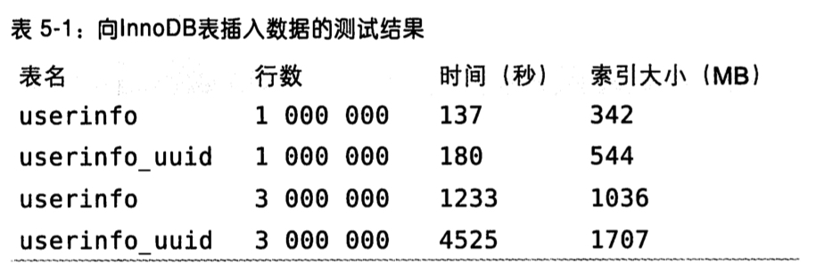

# 聚簇索引（Clustered Indexes）

* 什么是聚簇索引
> <font color=DarkSalmon size=3> 并不是一种单独的索引类型，而是一种数据存储方式。</font>
```md
具体的细节依赖于实现方式，InnoDB 的聚簇索引实际上在同一个结构中保存了 B-Tree 索引和数据行。
当表有聚簇索引时，它的数据实际上存放在索引的叶子页（leaf page）中。

术语‘聚簇’表示数据行和相邻的键值进错的存储在一起。
因为无法同时把数据行存放在两个不同的地方，所以在一个表中只能有一个聚簇索引。
（不过，覆盖索引可以模拟多个聚簇索引的情况）。
```
* 聚簇索引的数据分布


```md
叶子页包含了行的全部数据。但是节点页只包含索引列。以上案例中索引列包含的是整数值。
```
* InnoDB 聚簇索引
```md
InnoDB 通过主键聚集数据。
如果没有定义主键，InnoDB 会选择一个唯一的非空索引代替。
如果没有这样的索引，InnoDB 会隐式定义一个主键来作为聚簇索引。
聚集在同一个页面中的记录，包含相邻键值的页面可能会相距很远。
```
* 聚簇索引 分析
```md
聚簇索引可能对性能有帮助，但也可能导致严重的性能问题。
```
> * 优点：
```md
* 相关的数据保存在一起
  一些情况下，只需要从磁盘读取少数的数据页就能获取需要的数据。
  如实现电子邮箱时，可以根据用户ID来聚集数据，可以以较少的IO读取某个用户所有的邮件。
* 数据访问更快
  聚簇索引将索引和数据保存在同一个B-Tree中，
  因此聚簇索引获取数据通常比在非聚簇索引中查找要快。
* 使用覆盖索引扫描的查询可以直接使用页节点中的主键值。
```

> * 缺点：
```md
* 聚簇索引最大限度的提高了IO密集型应用的性能，
  但如果数据全部存放在内存中，则访问的顺序就没那么重要了，聚簇索引也就没有什么优势了。

* 插入速度严重依赖插入顺序，按照主键的顺序插入是加载数据到innodb表中速度最快的方式。
  但如果不是按照主键顺序加载数据，那么加载完成后最好使用OPTIMIZE TABLE 命令来重新组织一下表。

* 更新聚簇索引的代价很高
  因为会强制InooDB将每个更新的数据移动到新的位置。

* 基于聚簇索引的表在插入行，或者主键被更新导致需要移动行的时候
  可能面临’页分裂（page split）‘的问题。

* 聚簇索引可能导致全表扫描变慢，尤其是行比较稀疏，或者由于页分裂导致数据存储不连续的时候。

* “二级索引”（非聚簇索引）可能比想象的要大，因为二级索引的叶子节点宝航了引用行的主键列。

* 二级索引访问需要两次索引查找。
  二级索引叶子节点保存的不是指向行的物理位置的指针，而是行的主键值。
  所以查询方式是先获取主键值，再去聚簇索引查找对应的行。
  这里做了两次 B-Tree 查找。对InnoDB，自适应哈希索引能减少这样的重复工作。
```

* InnoDB 和 MyISAM 的数据分布对比
```sql
 CREATE TABLE layout_test (
        col1 int NOT NULL,
        col2 int NOT NULL,
        PRIMARY KEY(col1),
        KEY(col2)
);
```
```md
假设该表的主键取值 1 ~ 10 000，按照随机顺序插入并使用 OPTIMIZE TABLE 命令做了优化。
即磁盘上的存储方式已经最优，但行的顺序是随机的。
列 col2 从1 ~ 100随机赋值，所以会有许多重复值。
```
> * MyISAM 的数据分布
```md
MyISAM 按照数据插入的顺序存储在磁盘上。
```

```md
行旁边显示了行号，从0 开始递增。
因为行是定长的，所以 MyISAM 可以从表的开头跳过所需的字节找到需要的行。
（MyISAM 并不总是使用“行号”，而是根据定长还是变长的行使用不同策略。）

这种方式很容易创建索引。
```

```md
索引中的每个叶子节点包含“行号”。
```

```md
clo2列上的所有和其他索引没有什么区别。

事实上，MyISAM的主键索引和其他索引在结构上没有什么不同。
主键索引就是一个名为PRIMARY 的唯一非空索引。
```
> * InnoDB 的数据分布

```md
InnoDB中，聚簇索引“就是”表，所以不需要独立的行存储。

聚簇索引的每一个叶子节点都包含了主键值、事务ID、用于事务和MVCC的混滚指针以及所有的剩余列（上列是clo2）。
如果主键是一个前缀索引，InnoDB 也会包含完成的主键列和剩下的其它列。

InnoDB的二级索引和聚簇索引是不同的。
二级索引的叶子节点存储的是主键值。这样的策略减少了当出现移动或者数据页分裂时二级索引的维护工作。
使用主键值作为指针会让二级索引占用更多的空间，换来的好处是，InnoDB在移动行时，无需更新二级索引中的这个“指针”。

InnoDB 的非叶子节点包含了索引列和一个指向下级节点的指针，这对聚簇和二级索引都适用。
```


> * 对比


* 在InnoDB中按主键顺序插入行
```md
如果在使用 InnoDB 表时，没有数据需要聚集，那么可以定义一个代理键（surrogate key）作为主键，
主键的数据应该和应用无关，最简单的方法就是使用AUTO_INCREMENT自增列。
可以保证数据按顺序写入，对根据主键做关联操作的性能也很好。

最好避免随机的（不连续且值的分布范围非常大）聚簇索引，特别是对于IO密集型应用。
例如：UUID作为聚簇索引会很糟糕：
它使得聚簇索引的插入变得完全随机，这是最坏的情况，使得数据没有任何聚集性能。
```
* 使用自增主键和UUID插入效率对比

```md
先各插入 100w记录，然后继续插入 300w记录，使索引的大小超过服务器的内存容量。

注意到 UUID作为主键插入行不仅花费时间更长，而且索引占用空间也更大。
原因是主键字段更长，另一方面是由于页分裂和碎片导致的。
```

```md
上图显示插满一个页后继续插入相邻的下一个页的场景。
因为主键的值是顺序的，所以InnoDB把每一条记录都存储在上一条记录的后面。
当达到页的最大填充因子时（默认最大填充因子时页大小的 15/16，留出部分空间用于以后的修改），
下一条记录会写入新的页中。

一旦数据按照这种顺序的方式加载，主键页就会近似于被顺序的记录填满，这也正是所期望的结果
（然而二级索引页可能是不一样的）。
```

```md
再看下一UUID作为主键插入的情况，
因为新行的主键值不一定比之前插入的大，所以InnoDB无法简单地总是把新航插入到索引的最后，
而是需要为新行找寻合适的位置，通常是已有数据中间位置，并且分配空间。
增加了很多额外的工作，并导致数据分布不够优化。

* 主要缺点：
1. 写入的目标也可能已经刷到磁盘上并从缓存删除，或者还没加载到缓存中，
  在插入之前不得不先找到并从磁盘读取目标也到内存中，导致大量随机IO。
2. 因为写入是乱序的，InnoDB 不得不频繁做页分裂操作，以便为新的行分配空间。
  页分裂会导致大量的数据移动，一次插入最少需要修改三个也而不是一个页。
3. 由于频繁分页，页会变得稀疏并被不规则地填充，所以最终数据会有碎片。

* 解决方案
把这些随机值载入到聚簇索引后，做一次OPTIMIZE TABLE来重建表并优化页的填充你。

* 小结
可以看出，使用InnoDB时，应该尽可能地按照主键顺序插入数据，
并且尽可能地使用单调增减的聚簇键的值来插入新行。
```

* <font color=DarkSalmon size=2> 顺序主键什么时候回造成坏的结果？</font>
```md
对于高并发工作负载，在InnoDB中按主键顺序插入可能会造成明显的争用。
主键的上界会成为热点，因为所有的插入都发生在这里，所以并发插入可能导致间隙锁竞争。

另一个热点可能是AUTO_INCREMENT 锁机制。

如果运到这种情况，需要考虑重新设计表或者应用，或者更改 innodb_autoinc_lock_mode 配置。
如果不支持 innodb_autoinc_lock_mode 可以升级到新版，可能对这种场景会工作得更好。
```
