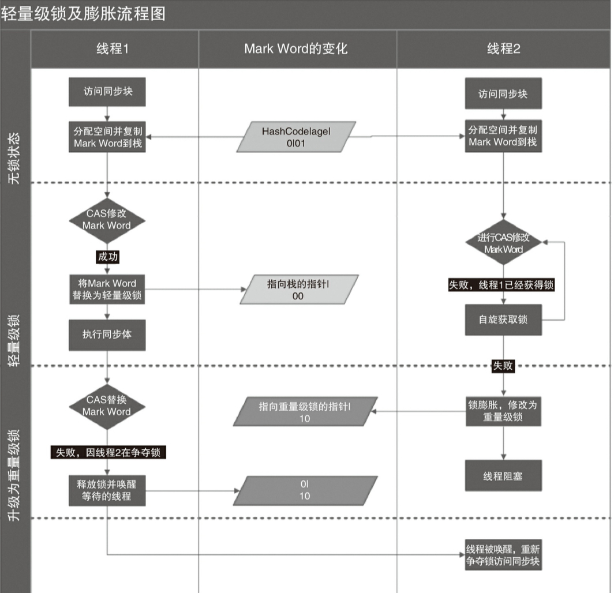
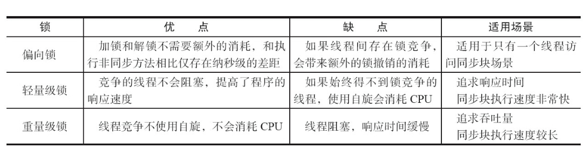

# synchronized 的实现原理与应用
```md
synchronized 实现同步的基础：Java 中的每一个对象都可以作为锁。

具体表现为三种形式：
对于普通同步方法，锁是当前实例对象，
对于静态同步方法，锁是当前类的Class对象，
对于同步方法块，琐是 synchronized 括号里配置的对象。

当一个线程试图访问同步代码块时，它首先必须获得锁，退出或抛出异常时必须释放锁。
```
* monitorenter 和 monitorexit 指令
```md
JVM 基于进入和退出Monitor 对象来实现方法同步和代码块同步。
代码块同步 使用 monitorenter 和 monitorexit 指令 实现，方法同步使用另外一种方式实现。

monitorenter 是在编译后插入到同步代码块的开始位置， monitorexit 插入结束和异常位置。
JVM 要保证 每个 monitorenter 必须有对应的 monitorexit 配对。

任何对象有一个monitor 与之关联，一个monitor被持有后，将处于锁定状态。
线程执行到 monitorenter 时，会尝试获取对象对应的 monitor 的所有权，即尝试获取对象锁。
```
## Java 对象头
```md
对象锁保存在Java 对象头中。
如果对象时数组类型，则JVM 用3个字宽 存储对象头，否则2字宽。
```
* 对象头结构
```md
* Mark Word 一个字长 
  存储对象自身的运行时数据
* Klass Word 一个字长
  存储对象的类型指针，该指针指向它的类元数据，JVM通过这个指针确定对象是哪个类的实例。
* Array length 一个字长
  对象时数组时才存在。
```
* Mark Word
```md
结构
* hash_code 25bit
* 分代年龄 4bit
* 偏向锁标志 1bit
* 锁状态标识位 2bit 不同的锁标识位，代表着不同的锁状态。
```
> 不同的锁状态，存储着不同的数据：


## 锁的升级与对比
```md
Java 6 为了减少获得锁和释放锁带来的性能损耗，引入了“偏向锁”和“轻量级锁”。

锁一共有4中状态，级别从低到高：
无锁状态
偏向锁状态
轻量级锁
重量级锁

这几个状态会随着竞争情况逐渐升级。
锁可以升级但不能降级，此策略的目的是为了提升锁的获取和释放的效率。
```
### 偏向锁
```md
研究发现，大多数情况下，锁不仅不存在多线程竞争，而且总是由同一线程多次获得。
在此情况下，为了让线程获得锁的代价降低引入偏向锁。

当一个线程访问同步块并获取锁时，会在对象头和栈帧中的锁记录里存储锁偏向的线程ID，
以后该线程在进入和退出同步块时都不需要进行加锁和解锁。
只需要测试Mark Work 是否存储了指向当前线程的偏向锁。
如果 测试失败，需要再测试 偏向锁标识是否设置成1，
如果没有设置，则使用CAS竞争锁，如果设置了，则尝试使用CAS将对象头的偏向锁指向当前线程。
```
* 偏向锁撤销
```md
偏向锁是一种等到竞争出现才释放锁的机制，当其他线程尝试竞争偏向锁时，持有偏向锁的线程才释放锁。

偏向锁的撤销需要等待全局安全点（这个时间点没有正在执行的字节码）。
首先暂停拥有偏向锁的线程，然后检查持有偏向锁的线程释放存活，
如果不处于活动状态，则将对象头设置成无锁状态；否则，拥有偏向锁的栈会被执行，遍历偏向对象的锁记录，
栈中的锁记录和对象头的Mark Work 要么重新偏向于其他线程，要么恢复到无锁状态或者标记对象不适合作为偏向锁，
最后唤醒暂停的线程。
```
* 关闭偏向锁
```md
Java 6 和7 默认开启偏向锁，它在应用程序启动几秒钟之后才激活，
如果有必要可以使用JVM 参数关闭延迟：-XX:BiasedLockingStartupDelay=0。

如果你确定应用程序里所有的锁通常情况下处于竞争状态，可以关闭偏向锁：
-XX:-UseBiasedLocking=false
那么程序默认会进入轻量级锁状态。
```
### 轻量级锁
* 加锁
```md
* Displaced Mark Word
JVM在线程执行同步块之前，会在线程的栈帧中创建用用于存储锁记录的空间，
并将对象头中的Mark Word复制到锁记录中，官方称为 “Displaced Mark Word”。

然后线程尝试使用CAS 将对象头中的 Mark Word 替换为指向锁记录的指针。
如果成功，当前线程获得锁，否则自旋来获得锁。
```
* 解锁
```md
使用原子的 CAS 操作将 Displaced Mark Word 替换回对象头，
如果成功，表示没有竞争，否则表示当前锁存在竞争，锁就会膨胀成重量级锁。
```


```md
因为自旋会消耗CPU，为了避免无用的自旋（比如获得锁的线程被阻塞了），
一旦锁升级成重量级锁，就不会再恢复回轻量级锁。
当锁处理重量级锁的状态下，其它线程试图获取锁时，都会被阻塞，
当持有锁的线程释放锁之后会唤醒这些线程，被唤醒的线程就会进行新一轮的竞争。
```
## 锁的优缺点对比

