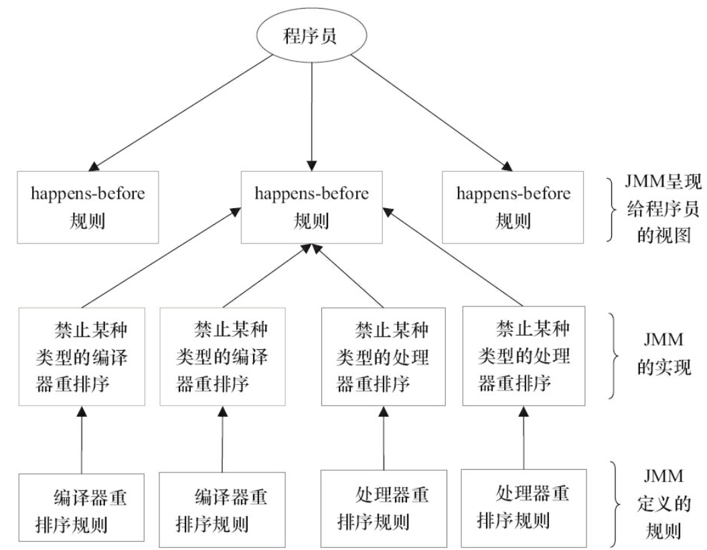

# happens-before
* 什么是 happens-before ？
```md
JDK 5 开始，Java 使用新的 JSR-133 内存模型。
JSR-133 使用 happens-before 来描述操作之间的内存可见性。

在JMM中，如果一个操作执行的结果要对另一个操作可见，那么这两个操作之间必要要有happens-before关系。
这两个操作可以是一个线程内，也可以是不同线程之间。
```

* happens-before 规则
```md
* 程序顺序规则
一个线程中的每个操作 happens-before 与该线程中的任意后续操作。
* 监视器锁规则
对一个锁的解锁 happens-before 随后对这个锁的加锁。
* volatile 变量规则
对 volatile 域的写  happens-before 任意后续对 这个 volatile 域读。
* 传递性规则
```
```md
* 注意
happens-before 关系并不意味着前一个操作必须要在后一个操作之前执行。
仅要求前一个操作对后一个操作可见，且前一个操作按顺序排后一个操作之前
（the first is visible to and ordered before the second）。
```
* happens-before 与 JMM

```md
happens-before 规则对应 一个或多个 编译器和处理器重排序规则。
happens-before 规则是JMM 提供给程序员的简单易懂规则，
避免了为了理解JMM提供的内存可见性保证而却学习复杂的重排序规则以及它的具体实现。
```