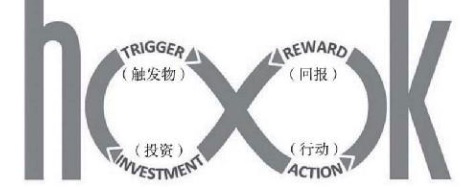

# 第7章 留存:唤醒并留住用户

彼得·德鲁克：商业的目的在于创造和留住顾客。
虽然没有人质疑这个著名的商业信条，但实际上大多数公司的顾客流失率——新用户流失的比例——都高得可怕。

***高留存率一般都是实现高利润的决定性因素。***
就职于贝恩公司的弗雷德里克·瑞克赫尔德有一项研究受到广泛引用，
这个研究表明，用户留存率每提高5个百分点，利润就会提高25~95个百分点。

原因之一是获取新用户的成本太高，而且现在争夺优质在线平台的竞争越来越激烈，这导致广告成本不断飙升。
在吸引新用户上的先期投入越多，每流失一位用户造成的损失就越大。

* Homejoy

通过强势的促销折扣战略吸引了数量庞大的初始客户，但由于它没能兑现承诺，导致用户将它的服务评价为“不靠谱”。
许多用户无法接受服务收费从第一次的促销价陡增到正常价。结果，只有15%~20%的用户预订了后续服务。

* Amazon
 
* * 订购计划 Amazon Prime在留存面大获成功
令人惊叹的是，用户加入Amazon Prime的时间越长，留存率就越高，那些进入第三个年头的用户续订率达到了前所未有的96%。

## 留存的复合价值

留住用户的时间越长，从他们身上获得更多收益的机会就越大，这一点无须赘言。
因为你既可以通过出售更多商品或服务来盈利，也可以通过持续的用户续订来盈利，  
还可以靠增加广告收入来盈利，因为你的庞大的 忠诚用户群对广告主有很高的价值。

每位用户带来的平均收益增加后，你便可以将更多资金用于增长投资，从而创造一个良性循环。
这是因为强劲的留存不仅可以创造更高的当 期盈利，还可以让你对未来的盈利能力更有信心。

高留存率的另外一个好处是可以让你的又碑营销和病毒营销收到更好的效果
因为用户使用产品的时间越长，他们谈论它，甚至向朋友和其他 人推荐它的可能性就越大。

## 迅速锁定最佳做法

增长黑客法可以让团队从这些想法中迅速选出一个来优先进行测试并快速得出结论，以明确下一步行动。

## 靠什么留住用户

留住用户最根本的一点是提供可以持续满足用户需求或者令他们感到愉悦的优质产品或服务，让产品或服务对他们而言不可或缺。
我们还提到，留存曲线是否平稳是衡量产品—市场匹配的最好标准。

探讨增长团队如何首先确保留存曲线是平稳的，或者更理想的情况是，如何使留存曲线在基准线的基础上逐渐上扬。

* 用户流失关键原因
```text
1. 尽管公司的留存曲线一开始很平稳，但是出于各种原因，曲线可能下滑，
   这可能是因为市场上出现了竞争产品，或者竞争对手推出了新功能、启动新宣传从而抢走了用户。
2. 公司没有采用最佳的沟通方式与用户 沟通
   比如，没有传达正确信息，没有把握好传达频率，导致用户不能马上想到使用App并最终被竞争对手抢走。
3. 还有可能是因为没有把 握好建立用户忠诚的机会
   没能让用户养成有规律的使用习惯或者让他们强烈感到自己受到重视并得到理解。
4. 又或者，公司提供的产品或服务已经不能满足用户新的迫切需求，或者用户找到了一种更方便也更令他们满意的方式来满足这种需求。
```

增长团队完全有能力发现留存率下滑的早期迹象，但决不能满足于此。团队应该利用快节奏试验过程不断提高留存率。
平稳的留存曲线绝非是留存的终极目标。

* 印象笔记 案例

* * 微笑图

从图中可以看出，用户使用印象笔记的时间越长，他们继续使用它的可能性就越大。
印象笔记的留存图之所以看起来像微笑，本质上是因为这个服务的实用性会随着时间的推移而逐渐增强。

* “储存价值”

许多成功的数字产品的留存率都会随着时间的推移而提高。
比如Instagram，又比如QuickBooks 这样的财务管理软件。

产品具有储存价值的公司在逐步提高留存率方面具有优势，但是，没有任何公司可以天真地以为用户会一直活跃地使用自己的产品。
公司必须脚踏实地地努力改进产品或服务，为了留住更多用户、让他们更积极地使用产品，脸谱网做了一系列努力。
任何公司都可以而且应该努力增加产品给用户带来的价值并逐渐提高用户参与度。

## 留存的三个阶段

不同的留存阶段需要采用不同的留存方法，布莱恩·鲍尔 弗强调，留存可分为三个阶段：

### 初期

留存初期非常关键，因为这个阶段将决定用户是继续使用或者购买产品或服务还是使用一两次之后就“沉睡”。
初期留存率可以作为衡量产品黏性的一个指标。

留存初期并没有一个统一的时间长度。
对移动App来说留存初期可能是一天，对于社交网络来说可能是一周或者两周，
对SaaS产品来说可能长达一个月甚至一个季度，对于电子商务公司来说留存初期通常是90天。
应该根据产品的行业标准以及你对用户行为的分析来决定产品的留存初期应该多长。

* 留存初期有一个优势
研究表明，这一阶段用户从产品中获得的价值越大，他们长期使用产品的可能性就越大。
而且通常这一阶段有许多改善用户体验的机会。

留存初期本质上是激活阶段的延伸。
你可以将它想成是为了确保用户真的活跃，而不是看一眼之后就对产品失去兴趣。

对于许多产品来说，新用户需要在特定时间段内重复使用产品并从中获得新体验达到一定的次数才能强化他们对产品价值的认识。
如，Pinterest 通过分析用户数据发现，如果新用户在注册后的两周内访问网站不足三次，那么他们很可能弃用产品。

### 中期

这时产品带来的新鲜感开始退去，要留住中期用户，增长团队的核心任务是让使用产品成为一种习惯。
让用户逐渐从产品或服务中获得满足感，这样无须鼓动用户也会 继续使用你的产品或服务，因为这已经成为他们日常生活的一个组成部分。

Snapchat 的用户在吃早饭或者吃完晚饭时常常翻阅朋友的动态。

### 长期
在这一阶段，增长团队的作用是确，保产品继续为用户带来更大价值。
团队必须试验各种方法不断完善产品，帮助产品开发团队决定升级现有功能或者推出全新功能的时机。
这个阶段 最关键的地方在于让用户不断重新认识到产品的不可或缺性。

## 什么是好的留存

先要讨论增长团队需要跟踪哪些数据以及如何通过分析数据来寻找可尝试的增长手段。

首先，不同的公司衡量留存的方法可能不同。
这是因为用户购买产品或者使用服务的频率在很大程度上取决于产品或服务本身的性质。

脸谱网希望用户每天都使用它的服务，
但苹果却明白，已经购买过iPhone的客户接下来几年内可能都不会再买(那些新款一上市马上就去买的“果粉”除外)。
正因为如此，苹果逐渐发展为不仅向客户提供设备，还提供服务。

### 复购买率

电子商务领域最基本的留存指标是用户的重复购买率，比如用户每月 购买产品的次数。许多电商企业计算90天内的重复购买率。
产品不同计算重复购买率的时间单位也不同。
因为大多数人每周至少去一趟超市，所以对于食品商店App团队来说可能需要关注短期内的购买频率，比如，大概 10天购买一次才是健康留存的标志。

### 留存指标
在设计留存指标时需要将你的计算结果与市场调研得出的同类产品或服务的最高留存率进行比较，或者与成功的竞争对手的留存率进行比较。
这些基准可以告诉你用户留存是正常还是比预期更好或者更差。

选择恰当的基准对于准确判断留存情况至关重要，行业出版物、贸易协会以及
诸如弗雷斯特(Forrester)和高德纳(Gartner)这样的研究公司都能 够提供不同行业的具体数据。

## 流失率

本质上是留存率的对立面，比如，好市多(Costco)会员的留存率是91%，那么它每年的流失率就是9%。
一定程度的流失是不可避免的，即使最受用户喜爱的产品也是如此。
但是，对于所有公司来说，流失率当然越低越好。

## 确定并跟踪群组

确定了留存的衡量指标后，下一步就是更细致地筛查留存数据
可以利用群组分析方法来确定不同用户群的留存率，这可以让你更加深入地解读数据，找出用户留下或者离开的原因。

可以将用户细分为不同类型的群组。
最基本的做法是按照获客时间进行划分，也就是按用户完成注册或者第一次购买的日期来分类，通常是按月份分组。
但正如前面所讲，对于某些类型的公司而言，按周甚至按天分组可能更有意义。

按照获客时间来跟踪用户可以让团队掌握用户群的整体状况。
随着营销力度的加大，现在获取的用户留存率是否与之前的用户一样高?
如果公司成功地吸引大量新用户，这表明销售或者注册进展很顺利。这种情况下，如果不按获客时间来跟踪留存就不容易发现隐藏的流失。

利用群组分析还可以察觉问题的苗头。
比如，增长团队可能发现，某次营销活动或者一年中某个时间段内获取的用户流失情况尤其严重
也许 他们发现，前两个月新用户很活跃，但从第三个月开始每个群组都有很多人开始流失。

* 视频流服务的例子
如何发现问题以及如何利用群组分析获得宝贵信息，找出流失原因，这个视频流服务的用户按月付费，并且可以在任意月份取消订购。
公司决定按照新用户注册的月份来对用户进行分类。

按获客月份对用户进行分类只是群组分析的第一步，还需要创建其他类型的群组。
例如按照获客渠道来划分群组，如用户推荐计划群组和付费广告群组等。
还可以根据用户访问网站的次数或者购买次数来分类。

不同的商业模式，比如电子商务，可能有不同的群组划分方式。

使用群组或者上面介绍的其他方式来跟踪留存需要强大的分析能力，这是像谷歌分析这样的基础网络分析工具无法做到的
你如果缺少一位专职的数据分析师，那你就可以考虑使用像 Mixpanel，Kissmetrics或者Amplitude这样能分析庞大数据的分析工具。

## 破解初期留存

分析完群组数据，找到初期留存中的流失节点并且通过调研确定了流失的原因，增长团队就可以开始试验破解的方法
用于改善初期留存的增 长手段与改善激活的增长手段本质上是一样的，因为前者其实是后者的一种延伸。
不断优化新用户体验，让用户尽可能快地体验到产品核心价值是这一阶段最重要的两大策略。

使用移动推送和邮件这样的触发物也能够有效强化用户对产品实用性和价值的认识。
留存初期增长团队不应该只想着靠触发物来唤回用户，团队还应该关注产品的用户体验以及进一步改进产品这两个方面(可以回到第六章复习 一下这些策略)。

## 让用户养成使用习惯

留存中期的核心目标是让用户养成使用产品的习惯，从而 巩固用户对产品的忠诚度。
对于一些产品而言，这意味着让用户习惯每天或者每周使用产品，但对另一些产品而言，用户使用产品的频率可能低到不足以称之为“习惯性”。
“习惯性”这个词与使用频率无关，只是单 纯地用它来表达当用户想买或者想使用某一类产品或服务时，
他们会第一个想到你而不是你的竞争对手，换句话说，他们是忠诚于你的。

让用户形成习惯关键在于让他们确信继续使用你的产品或服务能带给他们持久的回报。

* 《上瘾》
尼尔的上瘾模型，在增长黑客中被称为参与回环(engagement loop)。


在激活阶段讨论过外部触发物，如移动推送、邮件以及App内 提示等，这里它们又派上了用场，
这些提示可以促使用户采取行动，从而触发强大的参与回环，让用户形成习惯。

***增长团队应该找出触发物的最佳使用数量、方法和频率，以创造并强化用户习惯。***

要明白习惯是如何形成的，可以想一想人们去健身房健身的心理。
亚马逊订单系统负责人维贾伊·拉文德兰告诉《一网打尽》(TheEverything Store)的作者布拉德·斯通。
事实上，订购费的意义“绝不仅仅是99美元。它真正的意义在于改变人们的心理，让他们不去别的地方购物。
确实，Prime计划在创造习惯方面如此成功。

Amazon Prime的参与回环很明确，而且重复使用还能不断强化循环， 这也是Prime如此成功的原因。
当然，这个模式并非对所有人都适合。增长 团队应该根据产品的核心价值绘制自己的参与回环，然后不断衡量、监测和优化循环。
通过分析数据并且试验能给用户带来最大回报的触发物，团队就可以为自己的产品找到创造习惯的方法。

* 一个对大多数类型的产品都适用的原则是:
提升回报在用户眼中的价值可以带来更大的留存。

要让产品或者服务更易于形成习惯，增长团队应该试验向用户提供各种各样的回报，并鼓励他们通过行动来获取回报。
用户采取的行动越多，回报越大，他们眼中看到的回报价值也就越大。
团队应该进行群组分析，找出哪些用户最热衷于使用产品，他们使用最多的是哪些功能，哪些功能带来最大价值的回报，创造最高的留存。
团队还应该找出那些还不够活跃的用户，通过给他们提供更有吸引力的回报来激励他们更多使用产品。

## 提供实际的、体验式的回报

许多流行的回报策略都强调让顾客去“赚”节约的钱，或者给他们发购物券、代金券或者礼物。

特别是零售业，长期以来这个行业已经积累了许多这样的回报策略。
这些回报很强大，团队也确实应该在这方面大量开展试验。
重要的一点是，团队不应把目光局限在金钱或者省钱这样的回报上，而是应该试验产品体验这种回报。

***实际上，一些最易于习惯形成的回报是无形的回报。***
```text
这类回报中有不少值得试验
比如社交回报，脸谱网的“点赞”功能就在很大程度上促使发照片和评论成为用户的一种习惯。
同理，飞行常客奖励计划很早就开始使用诸如会员升级、贵宾休息室和优先值机这样的社交回报，而且它们相比折扣机票更能让用户保持忠诚。
```

团队应该创造性地思考可以提供什么样的无形回报，而且还应该试验将实际回 报和体验式的社交回报结合起来。

### 回报策略

按照激励—市场匹配原则，回报应该契合产品价值
近年来，在促进 习惯形成、提高留存(当然还有其他增长杠杆)方面，除了给用户提供特价优惠和折扣以外，还有三个值得注意的回报策略。

#### 品牌大使计划

这类计划通常结合了社会回报和实际回报，通过授予用户高级用户的称号来给用户提供社会认可以及其他的实际好处。

* Yelp 案例
Yelp精英队计划是利用这种方法提高留存最成功的案例。
通过给予第一个给商家留言的用户特殊认可并且让用户给那些有用、有趣或者只是单 纯“很酷”的评论点赞，Yelp就成功给用户提供了强大的社会回报，激励他们写更多的评论。

Yelp团队向最活跃的用户颁发“精英”奖章
Yelp主要的竞争对手，比如Citysearch和雅虎区域搜索，其用户在网站上留下超过6条评论的比例在5%~10%。
相比之下，Yelp用户中有超过65%的人在网站上写6 条甚至更多的评论。而且，Yelp网站总评论量的44%都是由精英用户贡献的。

餐馆、酒店、信用卡公司以及许多零售商很早就成功使用这类计划，巧妙地 将诸如归属感、社区和地位这样的社会回报与更实际的回报结合在一起。
美国运通百夫长卡，也就是广为人知的黑卡，就是一个经典例子。

* theSkimm 案例

向职业女性提供员工亲手编辑的每日新闻，要想成为“Skimmer大使”，读者需要向10个朋友 推荐这个服务
这样做的回报不仅包括获得网站公开认可，还包括名牌T恤、手提包、手机壳、社交机会以及在新闻电子报中刊登生日祝福等等。

#### 认可用户成就

***所有用户都看重来自公司的认可，哪怕只是很小的认可。***

对用户表达认可的最佳方式是肯定他们的某种成就或行为，或者使用营销圈中称为“行为邮件”(behavioral email)的方式。
也就是当用户完成了一个里程碑事件时就给他们发去祝贺邮件。

比如当你走到当日第一万步时，Fitbit(一家研发和推广健康乐活产品的新兴公司)就会给你发一条祝贺推送。

推特的联合创始人埃文·威廉姆斯创办的博客发布平台Medium会在用户文章被推荐50次或100次时向用户发送邮件。

这些推送也可能是告知你其他用户采取了一些可作为你的个人成就的行为。

#### 客户关系个性化

沃尔玛实验室(WalmartLabs)产品和工程部副主席舒维克·慕克吉指出，
公司在增长领域最重要的一个转变是从传统的“一对多”营销思维模式转变为提供完全个性化的“一对一”的用户体验。
比如，现在公司可以根据每位用户的喜好发送个性化邮件和产品推荐，即使用户数量达到几百万也能做到这一点。
这种大规模的个性化做法核心在于“理解用户，理解你所处的行业，并确保在二者之间建立完美的匹配”。

机器学习算法正在引发新一轮个性化浪潮，Boomtrain通过将机器学习与个性化相结合成功做到持续优化新闻内容的相关性。
团队还可以利用诸如Apache Spark(大数据处理引擎)提供的开源软件“机器学习图书馆”来建立自己的软件，这样也能取得同样的结果。

如果团队想进行个性化测试可以先从触发物入手，食品商店App团队可以向那些在App下单一次、从未下单以及App订单平均金额超过100美元的用户发送不同的邮件。

## 控制节奏

告诉用户马上会有新功能或者新产品以及这能给他们带来什么好处，可以有效地诱导用户一直使用产品。
苹果公司也巧妙地使用了这个策略，它让用户迫不及待地等着公司推出最惊艳的新产品，然后升级自己的设备。

但是，如果你对用户承诺很快就会有很棒的产品更新，却让他们一等再等，就可能惹怒用户。
这也是为何试验如此重要:它可以帮助团队确定公布消息的最佳时机。

## 保持长期活跃

一旦你在一定规模的用户群中实现了强劲的留存，下一步就是专注于如何让用户乐于使用你的产品并长期保持高度活跃：
```text
(1)优化现有的产品功能、推送以及对重复使用的奖励
(2)在一个较长的时间周期里定期推出新功能
```

许多公司都急于在短期内推出大量新功能，用产品团队的话来说，这叫功能膨胀(feature bloat)。
这样做往往会导致产品过于复杂而掩盖产品的核心价值。

在一份2005年的研究报告中，营销科学学会的研究员德博拉·维亚纳·汤普森、丽贝卡·汉密尔顿和罗兰·拉斯特指出，
将太多功能塞进产品中往往会损害长期留存。

因为“为了实现用户选择范围的最大化而在产品中加入许多功能最终可能降低用户终身价值。”
“公司应该考虑拥有更多功能有限但更加专业化的产品，而不是将所有可能的功能都集中在一个产品上”

当人们习惯了产品的外观和功能后，过快或者突然改变产品可能得不偿失。
增长团队可以通过试验给用户提供产品原型或试用版来评估拟推出的新功能是否具有吸引力。
增长团队中的所有成员都应该不断寻找机会来优化现有产品功能，实现留存最大化，同时开发新功能。

* 食品商店App团队
看看他们如何与这家食品连锁店的产品团队合作推出一个重要的新功能。

产品团队一 直在为App的一个新功能研发产品原型:用餐计划。
这项功能可以结合用户的购买历史以及App上最受欢迎的商品来向用户推荐全谷物食谱，让用户轻松购买所需要的食材。
顾客需要做的只是输入用餐人数然后点击提交，所需商品就按适当数量自动加入购物车。

增长团队和产品及营销团队共同确定了一个测试战略:
先向一定数量的用户提供用餐计划功能，同时试验如何提高这批用户使用这个功能的频率。

比如，增长团队掌握的数据显示，免费配送可以有效改善留存。
他们可以基于此向产品团队建议，通过用餐计划向用户推荐可以使他们的订单金额达到免运费标准的食谱。

他们也可以尝试利用触发物提醒用户App上更新了全谷物食谱推荐。

团队也应该测试何时以及如何向用户推荐这个用餐计划，如何向那些使用试用版本的用户介绍功能上的改变。

## 持续的用户引导

增加新功能并且越来越了解最活跃最满意的用户如何使用产品后，你需要继续引导用户，让他们了解可以从产品中获得怎样的价值。
因此，长期留存的另一个关键要素就是弄清如何让用户沿着学习曲线前行。
这个过程便是持续的用户引导，它与学习任何一门学科、一种乐器、一门语言或是一项技能的方法是一样的：
首先完成容易实现的小目标，然后逐渐提高 熟练程度。

应该将这种学习进程嵌入任何需要用户掌握的新功能中，让他们从产品中获得最大价值。
用户体验设计师哈里·布努将这个过程称为“爬坡”。

用户使用产品越来越熟练后，就应该引导他们开始关注以前从未用过的功能和刚推出的新功能。
布努强调，谷歌分析使用一系列渐进式的通知推送来引导用户更加深入地体验产品，这就是一个爬坡的好例子。
“他们监测用户行为，通过一个决策引擎来决定推送的内容，然后跟踪用户完成了哪些行为，适时引导用户开始新行为。”

增长团队应该测试持续的用户引导中所有的信息传达
比如向试验组发送有关新功能使用的不同版本的文字和图片说明。

## 复活“僵尸用户”

重新赢回已经弃用产品的用户，这在增长圈子里称为“复活”。
增长黑 客过程可以帮助你找到赢回从你的雷达上消失的“僵尸用户”的试验。

第一步 是调查用户当初消失的原因。
最简单的做法是采访那些取消或者不再使用产品的用户，直接询问他们离开的原因。
第一步是弄清楚人们离开的原因是否是可控的或者是可以解决的。

复活流失用户的大部分工作是靠邮件和广告来完成的。
如果团队注意到在一个预先设定的时间段内(长短可通过试验来确定)用户的购买活动或者其他活动降为零，那么就应该把他们纳入复活流(resurrection flow)。
有时公司可以通过为“冷淡”或休眠用户制作专门的自定义邮件和推送通知来激活他们。
因为这些用户已经很熟悉产品并且已经体验过产品的“啊哈时刻”，所以激活他们所需要的成本和努力相比获取全新的用户都更少。

最重要的一点是，你需要试验信息传达的措辞、频率以及持续时间来 确保你请求他们“回来”的信息不会惹烦或者进一步疏远用户，
否则你只会让他们对你的评价更差，从而彻底击碎挽回他们的一切希望。

有时候，公司应该接受事实，承认用户不会再回来了，然后停止向他们发送信息。
有时，用户会出于一些完全不受你控制的原因自愿回来，可能是因为一个朋友聊起他多么喜欢这个产品
或者因为用户换了一份新工作，而你的产品对他的工作有帮助;
或者因为他之前选择了你的竞争对手，而这个竞争对手破产了或者没有持续改进产品;
又或者是因为某个名人或用户的老板开始使用 这个产品，等等。

复活这类“冷淡”用户似乎是次要问题，毫无疑问，如果留存不乐观， 你首先关注的应该是新用户的初始留存。
但记住，每一位最终留住的用户都代表了可以持续为公司创收的机会，所以复活的努力是有价值的。
