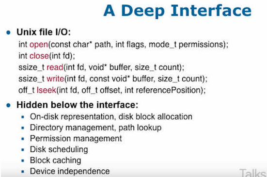

# A Philosophy of Software Design

## 什么是复杂性
```md
是任何使得软件难于理解和修改的因素。
软件设计的最大目标：就是降低复杂性（complexity）
```
* 来源
```md
代码的含义模糊指的是，代码里面的重要信息，看不出来。
代码的互相依赖指的是，某个模块的代码，不结合其他模块，就会无法理解。
```
* 危害
```md
它会递增
你做错了一个决定，导致后面的代码都基于前面的错误实现，整个软件变得越来越复杂。
"我们先把产品做出来，后面再改进"，这根本做不到。
```

## 复杂性的隔离
```md
 "如果能把复杂性隔离在一个模块，不与其他模块互动，就达到了消除复杂性的目的。"

改变软件设计的时候，修改的代码越少，软件的复杂性越低。
复杂性尽量封装在模块里面，不要暴露出来。如果多个模块耦合，那就把这些模块合并成一个。
```

## 接口 & 实现
```md
接口要简单，实现可以复杂。
好的 class 应该是"小接口，大功能"
好的设计是，大量的功能隐藏在简单接口之下对用户不可见，用户感觉不到这是一个复杂的 class。
```

* 实例
```md
最好的例子就是 Unix 的文件读写接口，只暴露了5个方法，就囊括了所有的读写行为。
```

## 实践
```md
减少抛错
	除了那些必须告诉用户的错误，其他错误尽量在软件内部处理掉，不要抛出。
```
