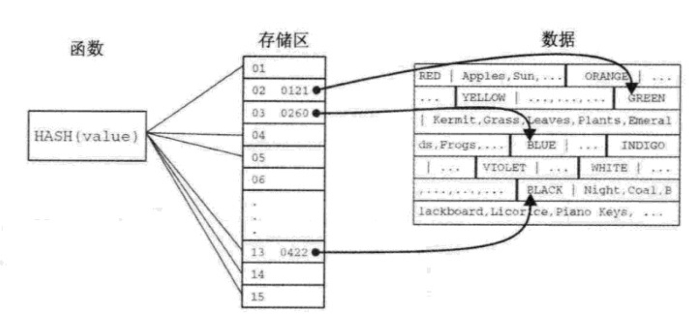

# 索引类型
```md
MySQL 支持在关系型数据库中常见的，主键索引、唯一索引、非唯一二级索引。

不同数据结构的实现会直接影响SQL查询的执行方式:
散列实现对直接查找方式能提供最优的性能，但对一定范围的查找却效率低下。
B-树的索引实现专门是为给定范围的查询设计的。
InfiniDb 和 Infobringht 引擎提供的面向列索引实现完全不需要用户自定义索引策略。
```
## 索引的数据结构
* B-树
```md
支持数据插入、控制操作以及通过管理一些列树根状结构的彼此联通的节点来做选择。

叶子节点用来存储数据，索引节点用来告诉叶子节点中数据的顺序，并帮助找到相应数据。
```

* B+树
```md
B+树支持 B-树索引的所有特性。
B+树中底层数据是根据被提及的索引列进行排序的。
B+树能通过叶子节点之间的附加引用来优化扫描性能。
```

* 散列
```md
始终以线性时间复杂度找到需要读取的行的位置。
```

* 通信 R-树
```md
R-树支持基于数据类型对几何数据进行管理。目前只有MyISAM使用R-树支持空间索引。
```
* 全文本
```md
全文本结构是一种MySQL采用的基本数据结构，MyISAM支持。
5.6版本中将要在InnoDB中加入全文本功能。

全文本在大规模系统中并没有什么实用价值，因为有很多专门用于文本检索的产品。
```
## MySQL实现
### MyISAM B-树

### InnoDB B+树 聚簇主键索引
```md
InnoDB主键索引(或称聚簇索引)使用B+树。
把所有数据都和对应的主键组织在一起，并且在叶节点添加额外的向前和向后的指针，
这样可以更方便得进行范围扫描操作。

注意：在其他数据库产品 （如 Oracle） 中，这种类型的结构叫做索引组织表。

在FS层面，InnoDB数据和索引信息都默认在公共InnoDB表空间中管理。
即 /var/lib/mysql/ibdata1 文件。
```
* innodb_file_per_table
```md
定义每个表使用单独的表空间，可以查看每个文件中合并的表数据和索引的大小。
/var/lib/mysql/data/table_name.ibd
```

* 填充因子(fill factor)
```md
InnoDB 用聚簇主键存储数据，数据占用的磁盘空间大小很大程度上取决于填充因子。
对于按序排列的主键，会用16K页面的15、16作为填充因子。
不按序排列的主键，默认情况下会在插入初始数据的时候为每个页面分配50%作为填充因子。
了解填充因子对估计潜在的磁盘存储空间需求是至关重要的。

MySQL 目前不提供调整这些存储因子计算量的方法。
```

* innodb_buffer_pool_size
```md
理解存储因子底层实现在于：
所有InnoDB数据和索引都是在内存中，通过 innodb_buffer_pool_size 设置的缓存池进行管理。
随着系统变大，这种对磁盘布局和内存占用将会直接影响SQL的性能。
```
* 数据存储
```md
InnoDB 数据存储在16K的页面中，每个页面中B+树结构相对于所有页面而言是有序的，
而每个页面的底层数据可以是无序的。
```
* 备注
```md
* 什么是填充因子
设置数据要占用page空间的比例，比如设置70%，即数据至少要填充page空间的70%。
设置填充因子的主要作用是为新数据预留一定的空间，当有新数据时，可以插入到预留的空间里，从而避免分页的发生。

当索引被新建立时，会根据填充因子的设置，对page页进行数据填充，使其达到设置的比例值。
例如：设置70%的填充因子，mysql会在page中填充占用70%的page空间的记录，预留30%的空闲空间。

填充因子只在新建索引及page分裂时，预留空间，保持设置的比例。
在之后的插入，修改，更新操作时，不再维持这个比例。
因为如果维持这个比例，就会造成频繁的分页操作，这就违背了设置填充因子的初衷—-为以后新插入的数据预留空间，降低page分裂的操作。

mysql会在page分裂后，判断page中的数据，
如果记录占用的比例小于设置的值（如70%），则会把这个page中的数据移动到其它的page。
```
> * 参考 [MySQL聚簇索引](https://yq.aliyun.com/articles/142879)

### InnoDB B-树 二级索引
```md
InnoDB 中的二级索引使用了B-树数据结构，但实现和MyISAM是不一样的。
二级索引存储的是主键值，而MyISAM存储的是数据的指针。

所以，当定义了很大的主键时，二级索引可能会更大。
但是二级索引中的主键值，在查询时可以作为索引列（虽然定义二级索引时可以不包含主键列），
这在做表连接和使用覆盖索引时会优化性能。
```
### Memory 散列 索引

### Memory B-树 索引

### InnoDB 内部散列索引
```md
InnoDB 内部还使用内存中的散列表来高效地进行主码查询。
用户只能通过 innodb_adaptive_hash_index 来配置是否启动。
```

