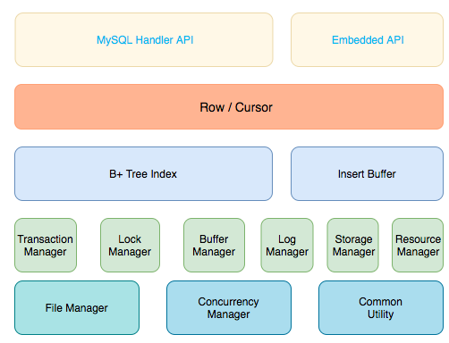

# Chapter 1 概览
> by SunnyChan 2018-11-26

## InnoDB 简史
```md 
MySQL 最初由瑞典 MySQL AB 公司开发，MyISAM 是 MySQL AB 公司的自有存储引擎。
InnoDB 由 芬兰赫尔辛基大学 Heikki Tuuri 创办的 Innobase 公司与 MySQL AB 公司
2001年开始合作开发， 并开源。InnoDB 占据了毫无疑问的优势。

Oracle 公司在 2005 年收购了 Innobase 公司， Sun 公司在 2008 年收购了 MySQL AB 公司。
在此后5年中，MySQL 发展缓慢，最终随着 Oracle 收购了 Sun，InnoDB 和 MySQL 都收归 Oracle 所有。
```

## InnoDB 源码
```md 
InnoDB 使用 C 语言实现，采用模块化的开发思想。
```


* File Manager 
```md 
InnoDb 对文件的各类操作，如 读、写、异步IO等。
```
* Concurrency Manager
```md
封装了引擎内部使用的各类 mutex 和 latch。
```
* Common Utility
```md
一些基本数据结构和算法的定义，如链表、哈希表等。
```
### 总结
* 第五层属于基础模块，都是通用模块，甚至可以在自己的工程中使用。  
* 第三、四层可以理解为 InnoDB 的内核实现部分，也就是事务、锁、缓存、日志、
  、存储、索引的实现模块。
* 上面两层是接口层，通过接口实现上层和存储引擎内部的交互。  
  InnoDb 存储引擎可以不依赖 MySQL 作为一个嵌入式的数据库存在，因此还存在嵌入式接口。